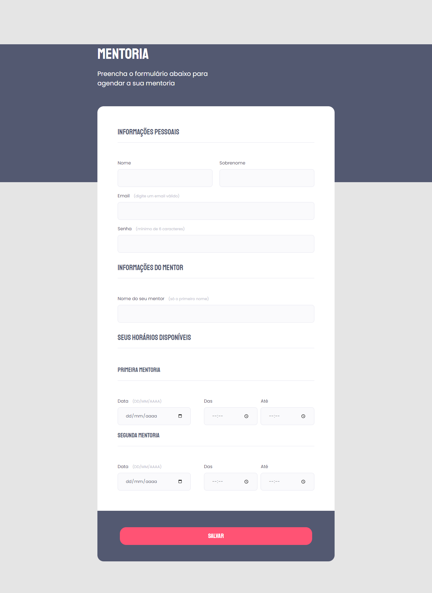

  

## 🖥️ Projeto
Nesse projeto pude desenvolvider uma página de formulário com o tema de uma mentoria, trabalhei muitos conceitos de formulário e os seus campos, além de estilizar de acordo com o layout do figma, ficou muito bonito o resultado final.

## 🚀 Tecnologias
Foi desenvolvido esse projeto no programa Explorer da Rocketseat no stage 02.

- HTML
- CSS
- GIT
- GITHUB
- FIGMA

## 👁 View
Aqui você pode visualizar o layout do projeto
<a 
  href="https://www.figma.com/file/6uaXX1XQXy9UaxdNYhwASA/Stage-03---Formul%C3%A1rio-intermedi%C3%A1rio-(Copy)?type=design&node-id=0-1&t=NViSIyPMma3oVK5N-0" target="_blank">clique aqui</a>
